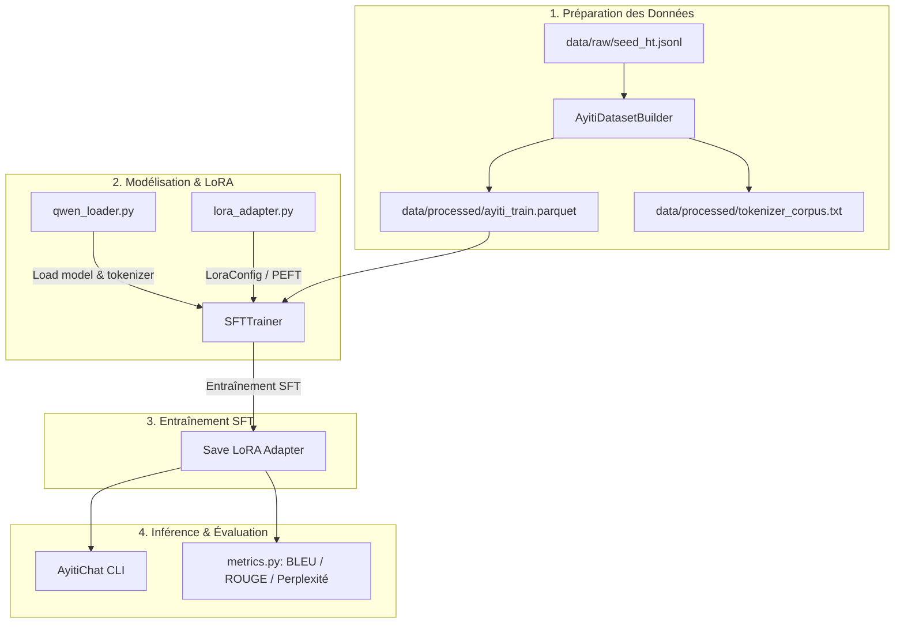

# 🇭🇹 Ayiti-AI — Document de Transition et d'Architecture Technique (Handover)

Ce document fournit un état des lieux complet du projet **Ayiti-AI**, conçu pour le fine-tuning et l'évaluation d'un modèle d'IA souverain haïtien basé sur **Qwen2.5-1.5B-Instruct** (multilingue : Kreyòl ayisyen `ht`, Français `fr`, Anglais `en`).

Il est structuré pour permettre à un développeur senior de comprendre rapidement l'architecture du projet, les choix d'implémentation et les prochaines étapes.

---

## 📐 Architecture Globale et Flow de Données

Le pipeline est modulaire et se décompose en 4 phases majeures : Ingestion/Préparation, Modélisation/PEFT, Entraînement SFT, et Évaluation/Inférence.



---

## 📁 Structure du Projet et Composants

### 1. Ingestion et Préparation des Données (`src/data/`)
* **[`dataset_builder.py`](file:///c:/Users/User/Documents/Glip/Ayiti IA/src/data/dataset_builder.py)** :
  * Définit la classe `AyitiDatasetBuilder` qui scanne `data/raw/` pour charger et fusionner les fichiers de données au format JSONL.
  * Effectue le nettoyage de texte (`clean_text`) en supprimant les caractères de contrôle et les espaces superflus tout en préservant les accents et spécificités de la langue créole.
  * Génère un dataset HuggingFace exporté en `.parquet` dans `data/processed/ayiti_train.parquet`.
  * Génère un fichier corpus `tokenizer_corpus.txt` regroupant l'ensemble des textes d'instructions et de sorties pour des besoins de vocabulaire / tokenizer.
* **[`collect_data.py`](file:///c:/Users/User/Documents/Glip/Ayiti IA/scripts/collect_data.py)** :
  * Script utilitaire CLI permettant de valider la syntaxe et la conformité des fichiers JSONL locaux (champs requis `instruction` et `output`), de fusionner des fichiers et de convertir des CSV.

### 2. Modélisation et Adaptateur PEFT (`src/models/`)
* **[`qwen_loader.py`](file:///c:/Users/User/Documents/Glip/Ayiti IA/src/models/qwen_loader.py)** :
  * Point d'entrée pour instancier le modèle de base et son tokenizer (`load_qwen_model_and_tokenizer`).
  * Gère la quantification dynamique **4-bit NF4** via `BitsAndBytesConfig` si un GPU CUDA est détecté, ou charge le modèle en `float16` sur CPU si nécessaire pour les tests de développement.
  * Configure le tokenizer avec les tokens spéciaux adéquats (liaison du `pad_token` à `eos_token`).
* **[`lora_adapter.py`](file:///c:/Users/User/Documents/Glip/Ayiti IA/src/models/lora_adapter.py)** :
  * Génère la configuration LoRA avec `get_lora_config()` ciblant spécifiquement les modules de projection (`q_proj`, `k_proj`, `v_proj`, `o_proj`).
  * Implémente `apply_lora()` pour attacher un adaptateur LoRA au modèle de base à partir des hyperparamètres chargés depuis un fichier de configuration YAML.

### 3. Entraînement SFT (`src/training/` & `scripts/`)
* **[`trainer.py`](file:///c:/Users/User/Documents/Glip/Ayiti IA/src/training/trainer.py)** :
  * Pilote l'entraînement via la classe `SFTTrainer` de la bibliothèque TRL.
  * Contient le formateur de batch `formatting_prompts_func` qui convertit les colonnes `instruction`, `input` et `output` au format ChatML attendu par Qwen2.5, tout en injectant le prompt système spécifique d'identité Ayiti-AI.
  * Gère dynamiquement le choix du type de précision (`bf16` si supporté par le GPU, `fp16` sinon, ou désactivé sur CPU).
* **[`run_training.py`](file:///c:/Users/User/Documents/Glip/Ayiti IA/scripts/run_training.py)** :
  * Script d'exécution CLI qui charge la configuration YAML générale (`config/training_config.yaml`) et lance le processus `train_sft()`.

### 4. Suite d'Évaluation (`src/evaluation/`)
* **[`metrics.py`](file:///c:/Users/User/Documents/Glip/Ayiti IA/src/evaluation/metrics.py)** :
  * **BLEU** : Implémenté via la bibliothèque `sacrebleu` (inclut la gestion des pénalités de brièveté `bp`).
  * **ROUGE** : Calcule les scores ROUGE-1, ROUGE-2 et ROUGE-L via la bibliothèque `rouge-score`.
  * **Perplexité (PPL)** : Calcule la perplexité moyenne sur une séquence en calculant l'exponentielle de la perte d'entropie croisée (cross-entropy loss) sur l'ensemble des tokens évalués.
  * **`evaluate_model`** : Intègre les prédictions en mode greedy (pour la reproductibilité) et agrège toutes les métriques de test.

### 5. Inférence et Interface de Chat (`src/inference/`)
* **[`chat.py`](file:///c:/Users/User/Documents/Glip/Ayiti IA/src/inference/chat.py)** :
  * Fournit une classe `AyitiChat` d'inférence autonome.
  * Supporte les prompts systèmes adaptés à la langue cible (Kreyòl, Français, Anglais).
  * Gère la mémorisation de l'historique de conversation (ChatML structure) et offre une boucle CLI interactive de discussion directement dans le terminal.
  * Permet de fusionner à la volée un adaptateur LoRA enregistré (`PeftModel.merge_and_unload`).

---

## 🧪 Tests Unitaires et Validation du Pipeline

Une suite robuste de tests unitaires a été mise en œuvre dans le répertoire [`tests/`](file:///c:/Users/User/Documents/Glip/Ayiti IA/tests) pour valider chaque brique logicielle indépendamment des fichiers de poids lourds HuggingFace (utilisation de mocks et de répertoires temporaires `tmp_path`).

Les tests couvrent :
* Le nettoyage textuel et le formatage unicode (préservation des accents kreyòl/français).
* La validation de l'ingestion de fichiers JSONL erronés ou vides.
* La génération de la configuration LoRA et la parsing de fichiers YAML.
* L'export des modules et des fonctions du package global.

### Résultat de l'exécution des tests

L'intégralité de la suite de tests (31 tests unitaires) a été exécutée et validée avec succès :
```bash
$ pytest tests/ -v
======================== 31 passed in 79.33s (0:01:19) ========================
```

---

## ⚙️ Fichiers de Configuration principaux

* **[`Makefile`](file:///c:/Users/User/Documents/Glip/Ayiti%20IA/Makefile)** :
  Raccourcis de commandes pour simplifier le flux de travail de développement :
  * `make install` : Installe le requirements.txt.
  * `make data` : Exécute `dataset_builder` (conversion JSONL -> Parquet).
  * `make validate` : Valide la conformité du dataset brut.
  * `make test` : Exécute les tests unitaires.
  * `make train` : Lance le script d'entraînement SFT.
  * `make inference` : Démarre l'interface de chat interactive dans le terminal.
* **[`config/training_config.yaml`](file:///c:/Users/User/Documents/Glip/Ayiti IA/config/training_config.yaml)** :
  Paramètres par défaut du fine-tuning (epochs, batch size, learning rate, accumulation de gradient, etc.).
* **[`config/lora_config.yaml`](file:///c:/Users/User/Documents/Glip/Ayiti IA/config/lora_config.yaml)** :
  Hyperparamètres LoRA (rank `r`, alpha, dropout, target modules).

---

## 🚀 Prochaines Étapes Immédiates

1. **Entraînement de validation locale** : Lancer un cycle d'entraînement CPU (ou GPU local si disponible) sur le seed dataset kreyòl pour vérifier l'écriture correcte de l'adaptateur PEFT final dans le répertoire `results/ayiti_lora`.
2. **Évaluation post-entraînement** : Exécuter la fonction `evaluate_model` du module `metrics.py` avec le modèle fine-tuné et comparer les scores BLEU et ROUGE par rapport au modèle de base Qwen.
3. **Optimisation GPU et passage à l'échelle** : Migrer le pipeline d'entraînement sur une instance GPU (ex: Google Colab A100/T4 ou serveur cloud dédié) avec des jeux de données d'instructions créoles plus volumineux.
